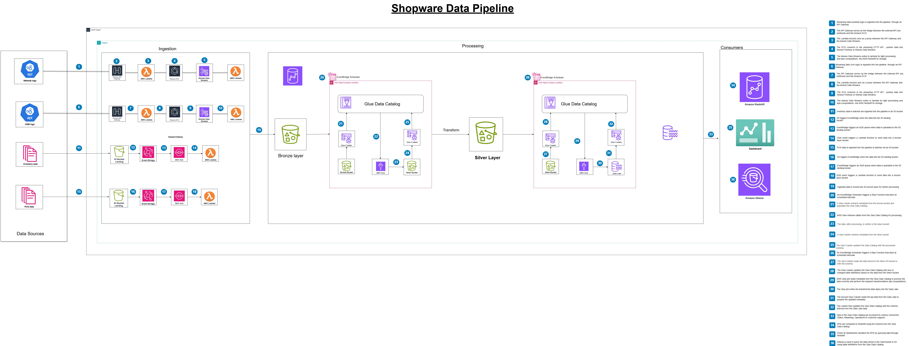

# Shopware Data Pipeline

## Overview

The Shopware Data Pipeline is a comprehensive data engineering solution designed to collect, process, and analyze data from four distinct sources—two streaming and two batch—to support decision-making across various Shopware teams. The pipeline follows the Medallion Architecture (Bronze, Silver, Gold layers) to transform raw data into actionable business insights, enabling teams to track key performance indicators (KPIs) and leverage data via ad-hoc querying, dashboards, and data marts.

## Project Objectives

1. **Data Integration**: Integrate data from multiple sources, including batch (POS, Inventory) and streaming (Web Traffic, CRM Interactions).
2. **Data Transformation**: Clean and transform raw data to meet business needs.
3. **Data Accessibility**: Provide teams with access to data via ad-hoc querying, dashboards, or data marts.
4. **Data Storage**: Organize data efficiently using data lakes, data warehouses, and data marts.
5. **KPI Tracking**: Enable teams to track department-specific KPIs.

## Architecture

The architecture follows a modern data lakehouse approach with three distinct layers:

1. **Bronze Layer (Raw Data)**: Initial data ingestion from source systems.
2. **Silver Layer (Processed Data)**: Cleaned, validated, and transformed data.
3. **Gold Layer (Business Insights)**: Aggregated data ready for analytics and reporting, stored in Redshift and S3.



## Data Sources

The pipeline ingests data from four sources:

- **POS Data (Batch, Daily)**: Sales transactions including quantity, revenue, discounts, etc. Used by Sales, Operations, and Finance teams.
- **Inventory Management Data (Batch, Hourly)**: Real-time inventory levels and restocking data. Used by Operations and Sales teams.
- **Web Traffic Logs (Streaming, Real-Time)**: User behavior, page views, and session data. Used by Marketing and Data Analysts.
- **CRM Interactions (Streaming, Real-Time)**: Customer interactions and feedback. Used by Marketing and Customer Support teams.

## Components

### Data Ingestion

1. **Batch Data (POS, Inventory)**:
   - **ECS Fargate Connectors**: Python applications in Docker containers poll source APIs at regular intervals (daily for POS, hourly for Inventory).
   - Data is sent to Kinesis Data Streams for processing.
2. **Streaming Data (Web Traffic, CRM Interactions)**:
   - **API Gateway Webhooks**: HTTP endpoints for external systems to push real-time data.
   - Data is forwarded to Kinesis Data Streams.

### Data Storage & Processing

1. **Kinesis Data Streams**:
   - Handles real-time data streaming for Web Traffic and CRM Interactions.
   - Configured with proper sharding for scalability.
2. **Kinesis Data Firehose**:
   - Delivers data to S3 for long-term storage in the Bronze layer.
   - Configures data format and partitioning.
3. **S3 Data Lake**:
   - Stores data in the Medallion Architecture:
     - **Bronze Bucket**: Raw data from all sources.
     - **Silver Bucket**: Processed data after transformation.
     - **Gold Bucket**: Analytics-ready data for reporting.
4. **AWS Glue**:
   - ETL jobs for data transformation between layers.
   - Data Catalog for metadata management.
   - Crawlers to discover and catalog data.
5. **AWS Lambda**:
   - Processes streaming data (Web Traffic, CRM Interactions).
   - Computes KPIs for Marketing and Customer Support teams.
   - Saves results to Amazon Redshift.
6. **EventBridge and Step Functions (Batch Data)**:
   - **First EventBridge Trigger**: Detects new batch data in the Bronze layer and triggers a Step Function to transform and move data to the Silver layer.
   - **Second EventBridge Trigger**: Detects processed data in the Silver layer and triggers another Step Function to compute KPIs, saving results to Redshift and the Gold layer in S3.
7. **Amazon Redshift**:
   - Stores KPI results for both streaming and batch data.
   - Provides a data warehouse for business-wide queries.

### Analytics & Visualization

1. **Amazon Athena**:
   - SQL queries against data in S3 for ad-hoc analysis.
2. **Amazon SageMaker**:
   - Machine learning models for predictive analytics (e.g., customer segmentation).
3. **Power BI**:
   - Connects to Redshift for dashboard visualizations of KPIs.
4. **Data Marts**:
   - Team-specific aggregated data for Sales, Marketing, and Finance teams.

## Key Performance Indicators (KPIs)

### Sales Team (via POS, Inventory Data)
- Total Sales by Region/Product
- Stock Availability
- Product Turnover Rate

### Marketing Team (via Web Traffic, CRM Interactions)
- Customer Engagement Score
- Session Duration & Bounce Rate
- Loyalty Activity Rate

### Operations Team (via Inventory, POS)
- Inventory Turnover
- Restock Frequency
- Stockout Alerts

### Customer Support Team (via CRM Interactions)
- Feedback Score
- Interaction Volume by Type
- Time-to-Resolution

## Setup Instructions

### Prerequisites

- AWS Account with appropriate permissions
- AWS CLI configured locally
- Docker installed locally
- Terraform installed locally
- Python 3.11 or higher

### Deployment Steps

1. **Clone the Repository**:
   ```bash
   git clone <repository-url>
   cd shopware-data-pipeline
   ```

2. **Build and Push Docker Images**:
   ```bash
   # For POS Data Connector
   cd batch-connectors/pos-infra/scripts
   ./build_push_ecr.sh
   
   # For Inventory Data Connector
   cd batch-connectors/inventory-infra/scripts
   ./build_push_ecr.sh
   
   # For CRM Logs Connector
   cd api-gw-webhooks/crm-logs-infra/scripts
   ./build_push_ecr.sh
   
   # For Web Logs Connector
   cd api-gw-webhooks/web-logs-infra/scripts
   ./build_push_ecr.sh
   ```

3. **Deploy Infrastructure with Terraform**:
   ```bash
   # For POS Infrastructure
   cd batch-connectors/pos-infra/terraform
   terraform init
   terraform apply
   
   # For Inventory Infrastructure
   cd batch-connectors/inventory-infra/terraform
   terraform init
   terraform apply
   
   # For CRM Logs Infrastructure
   cd api-gw-webhooks/crm-logs-infra/terraform
   terraform init
   terraform apply
   
   # For Web Logs Infrastructure
   cd api-gw-webhooks/web-logs-infra/terraform
   terraform init
   terraform apply
   ```

4. **Deploy Glue Jobs and Step Functions**:
   - Upload Glue scripts to S3.
   - Create and configure Glue jobs and Step Functions using the AWS Console or Terraform.
   - Configure EventBridge rules to trigger Step Functions for batch data processing.

5. **Set Up Redshift and Power BI**:
   - Create a Redshift cluster and configure access.
   - Connect Power BI to Redshift for dashboard creation.

6. **Verify Deployment**:
   - Check AWS Console to ensure all resources are created.
   - Test webhook endpoints for streaming data.
   - Monitor CloudWatch logs for connector applications and Step Functions.

### Configuration

Key configuration files:
- `batch-connectors/pos-infra/terraform/terraform.tfvars`: POS pipeline configuration
- `batch-connectors/inventory-infra/terraform/terraform.tfvars`: Inventory pipeline configuration
- `api-gw-webhooks/crm-logs-infra/terraform/terraform.tfvars`: CRM pipeline configuration
- `api-gw-webhooks/web-logs-infra/terraform/terraform.tfvars`: Web traffic pipeline configuration
- `batch-connectors/pos-infra/connector/.env`: POS connector environment variables
- `batch-connectors/inventory-infra/connector/.env`: Inventory connector environment variables
- `api-gw-webhooks/crm-logs-infra/connector/.env`: CRM connector environment variables
- `api-gw-webhooks/web-logs-infra/connector/.env`: Web connector environment variables

## Data Flow

### Bronze Layer (Data Ingestion)

1. **Batch Data Collection (POS, Inventory)**:
   - ECS Fargate connectors poll source APIs:
     - POS: Daily updates.
     - Inventory: Hourly updates.
   - Data is sent to Kinesis Data Streams and stored in S3 Bronze buckets.
2. **Streaming Data Collection (Web Traffic, CRM Interactions)**:
   - Real-time data pushed via API Gateway webhooks.
   - Data is sent to Kinesis Data Streams and stored in S3 Bronze buckets.

### Silver Layer (Data Processing)

1. **Batch Data**:
   - EventBridge detects new data in the Bronze layer.
   - Triggers a Step Function to run AWS Glue jobs for cleaning, validation, and transformation.
   - Results are stored in S3 Silver buckets.
2. **Streaming Data**:
   - AWS Lambda processes streaming data in real-time.
   - Data is cleaned and transformed, then stored in S3 Silver buckets.

### Gold Layer (Analytics)

1. **Batch Data**:
   - EventBridge detects processed data in the Silver layer.
   - Triggers a Step Function to compute KPIs using AWS Glue jobs.
   - Results are stored in Redshift and S3 Gold buckets.
2. **Streaming Data**:
   - AWS Lambda computes KPIs for Marketing and Customer Support teams.
   - Results are stored in Redshift.
3. **Analytics Access**:
   - Amazon Athena for SQL queries on S3 data.
   - Power BI for dashboards connected to Redshift.
   - Notebooks for data science workflows via SageMaker.

## Monitoring and Maintenance

1. **CloudWatch Monitoring**:
   - Logs from all components.
   - Metrics for Kinesis, Lambda, ECS, and Step Functions.
   - Alarms for critical thresholds.
2. **Error Handling**:
   - Automatic retries in connectors.
   - Dead-letter queues for failed processing.
   - Error notifications via SNS.
3. **Scaling**:
   - ECS services scale based on CPU/memory usage.
   - Kinesis streams can be resharded for higher throughput.
   - Glue jobs configured with appropriate DPUs.

## Troubleshooting

### Common Issues

1. **Connector Not Sending Data**:
   - Check CloudWatch logs for errors
   - Verify network connectivity to source APIs
   - Ensure IAM permissions are correctly configured

2. **Glue Job Failures**:
   - Check job logs in CloudWatch
   - Verify input data schema matches expectations
   - Check for sufficient IAM permissions

3. **Missing Data in Analytics**:
   - Verify Glue crawlers have run successfully
   - Check S3 bucket permissions
   - Ensure data partitioning is correctly configured

## Contact

For questions or support, please contact the data engineering team.
